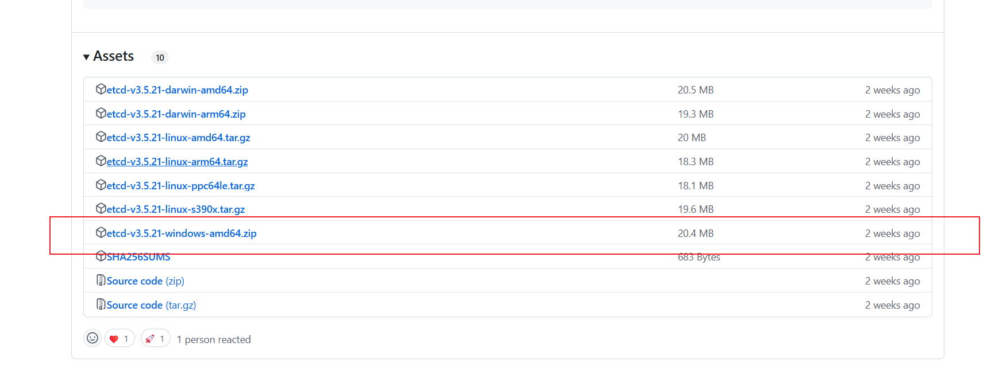

# 🚀 Spring Boot 面试刷题网站 🚀

**作者**: [若谷](https://github.com/ruogu-coder) 🌟

## 📘 简介

Spring Boot 面试刷题网站是一个**集成众多实用功能和组件**的Spring Boot项目，🚀助力开发者**快速构建稳定、高效的后端服务**。模板内嵌了MySQL、Redis、Sa-Token认证鉴权、Spring Boot Admin监控中心、OpenAPI 3规范支持、COS对象存储、文件上传等功能，并使用了Spring Boot 2.7、Knife4J（Swagger UI的增强版）作为接口文档管理工具。🔧

## 🎨 功能特性

- 🔰 **Spring Boot 2.7**：基于最新版本的Spring Boot框架，提供强大的自动配置和快速开发能力。
- 💾 **MySQL**：使用MySQL作为数据库存储，支持高性能、高并发的数据存储需求。
- 🐢 **Redis**：集成Redis作为缓存和消息中间件，助力提升系统性能和响应速度。
- 🔑 **Sa-Token**：轻量级无状态Java权限认证框架，提供便捷的认证鉴权功能。
- 🔭 **Spring Boot Admin**：提供对Spring Boot应用的监控管理，轻松查看应用状态、性能指标等。
- 📖 **OpenAPI 3**：支持最新的OpenAPI 3规范，用于接口文档描述，方便前后端开发人员进行接口对接。
- 📁 **COS对象存储**：集成COS（如云厂商的云对象存储服务）实现文件存储，满足文件存储和访问的需求。
- 📂 **文件上传**：支持文件上传功能，轻松实现用户文件上传至服务器。
- 📘 **Knife4J**：基于Swagger UI的接口文档管理工具，提供友好的界面和丰富的功能，方便开发者查看和管理接口文档。

## 📘 使用说明

### 1️⃣ 克隆项目

```bash
git clone https://github.com/ruogu-coder/javaInterviewPro.git
cd javaInterviewPro
```

### 2️⃣ 配置环境

- 创建`application-local.yml`文件中的mysql、Redis、COS、elasticsearch、hotkey等配置信息，确保与环境相匹配。
- COS从腾讯云对象存储中获取Key和密钥，具体参照官方文档：https://console.cloud.tencent.com/cos/bucket

####  Elasticsearch 配置

由于项目用的 Spring Boot 2.x版本，对应的 Spring Data Elasticsearch 客户端版本是4.x，支持的 Elasticsearch是 7.x，所以建议 Elasticsearch 使用 7.x 的版本。

- elasticsearch下载(windows)地址：https://www.elastic.co/guide/en/elasticsearch/reference/7.17/zip-windows.html

- 官方文档：https://www.elastic.co/guide/en/elasticsearch/reference/7.17/setup.html

  安装完成进入es目录执行如下命令：

```bash
.\bin\elasticsearch.bat
```

​	测试是否启动成功：

```bash
curl -X GET "localhost:9200/?pretty"
```

- 安装Kibana（注：也要使用7.17版本）

  参考官方文档：https://www.elastic.co/guide/en/kibana/7.17/introduction.html

​	安装地址：https://www.elastic.co/guide/en/kibana/7.17/install.html
​	安装完成后进入kibana目录：

```bash
.\bin\kibana.bat
```

​	kibana启动成功访问地址：`http://localhost:5601`

在项目目录`sql/post_es_mapping.json`需要在kinbana中创建es索引，但是在此之前需要安装中文分词器：

在ES目录下cmd执行：（注意版本和es一致）

```bash
.\bin\elasticsearch-plugin.bat install https://release.infinilabs.com/analysis-ik/stable/elasticsearch-analysis-ik-7.17.23.zip
```

安装成功后需要重新启动ES，在Kinbana的开发工具中执行：

```bas
PUT /question_v1
# sql/post_es_mapping.json 的内容粘贴
```

#### HotKey 配置

	1. 安装ETCD

    安装地址：https://github.com/etcd-io/etcd/releases



    安装完成后，双击etcd.exe 服务默认占用2379 和2380端口（2379:提供HTTP API服务，和其他交互 2380:集群中节点间通讯）

	2. 下载HotKey 

    官方地址：https://gitee.com/jd-platform-opensource/hotkey

    请注意本项目使用的是v0.0.4版本，JDK要小于17！！！

    将项目导入到IDEA后，启动worker 连接上ETCD 

    启动Dashboard 控制台 

    	- 配置MYSQL连接 在resource目录下有建表语句 导入即可
    	- 启动后访问http://127.0.0.1:端口号 账号默认admin 密码 123456
    	- 初次使用需要创建APP 建议用户管理创建用户 所属APP和本项目名称一致即可 interView
    	- 添加成功即可 使用maven 执行install命令 将worker打包到本地代码仓库 本项目中引用了worker的依赖

#### Mysql 配置

​	mysql 5.7 在sql目录下有建表语句和初始数据的sql 账号默认xiaozhang 密码 12345678

#### Redis 配置

​	任意版本的Redis即可 和yml配置相对应

### 3️⃣ 启动项目

```bash
mvn javaInterviewPro:run
```
使用的是IDE（如IntelliJ IDEA或Eclipse），直接运行主启动类即可启动项目。🏃

### 4️⃣ 访问接口文档

在浏览器中输入`http://localhost:8080/doc.html`（默认端口为8080，根据实际情况调整）即可访问Knife4J提供的接口文档页面，轻松查看和管理项目中的接口信息。📖

### 5️⃣ 监控管理

Spring Boot Admin的监控管理页面通常可以通过`http://localhost:8080/bootAdmin`访问（默认端口为8080，根据实际情况调整）。在该页面上，你可以查看应用的运行状态、性能指标、日志信息等。🔍

## 💡 注意事项

- 🔍 请确保已经正确配置数据库、Redis等外部服务，并检查连接信息是否正确。
- 🔧 如有需要，可以根据项目实际情况调整配置和代码，以满足特定需求。

## 💪 贡献与反馈

如果你在使用过程中遇到问题或有任何建议，欢迎通过GitHub的Issue或Pull Request进行反馈和贡献。🤝 非常期待你的参与和贡献！

## 📧 联系方式

- 邮箱：[1687438992@qq.com](mailto:1687438992@qq.com)
- GitHub仓库：[https://github.com/ruogu-coder/spring-boot-init](https://github.com/ruogu-coder/spring-boot-init) 🔗